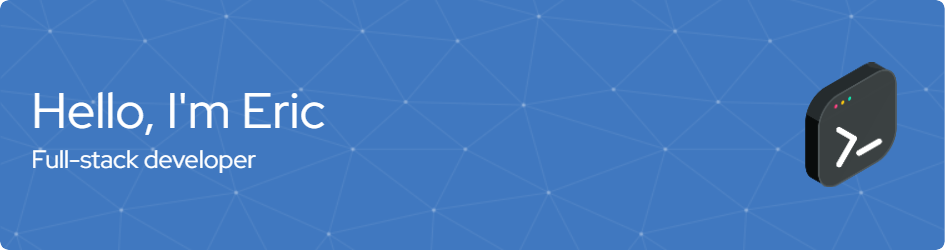

Hey there 👋

I’m Eric, a senior full-stack engineer with 20+ years of experience delivering high-quality software solutions. I leverage my knowledge and experience to build interactive and user-focused website designs to scale.  

 

## :rocket: What I Do

- Design and build mobile-first websites and browser-based applications from the ground up.
- Architect cloud-native back-ends for websites and mobile apps.
- Build Restful API's that can be consumed by any software.
- Create integrations between applications and data sources.
- Develop reports, data visualizations and their data sources.
  
 

## 💼 Toolbox

 
 

